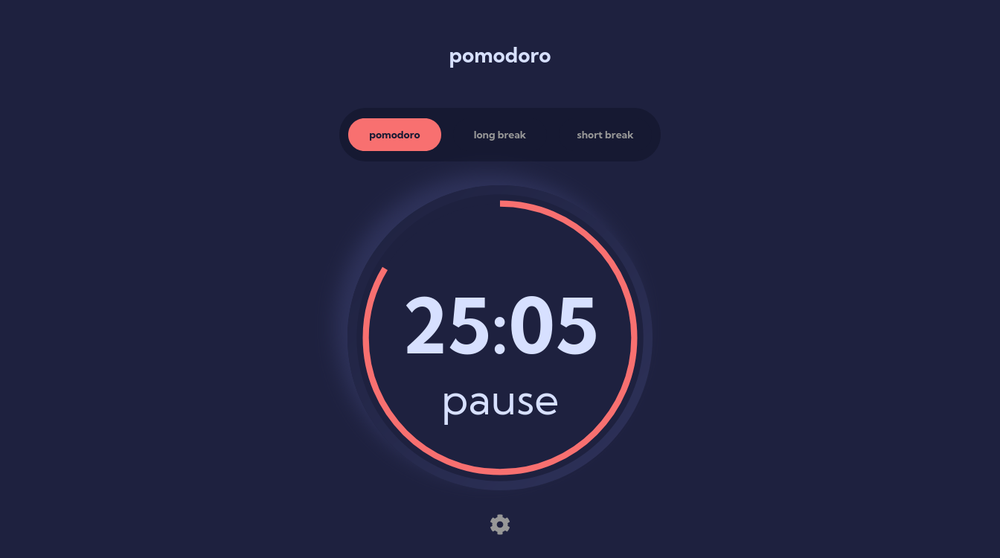

# Frontend Mentor - Pomodoro app solution

This is a solution to the [Pomodoro app challenge on Frontend Mentor](https://www.frontendmentor.io/challenges/pomodoro-app-KBFnycJ6G). Frontend Mentor challenges help you improve your coding skills by building realistic projects. 

## Table of contents

- [Overview](#overview)
  - [The challenge](#the-challenge)
  - [Screenshot](#screenshot)
  - [Links](#links)
- [My process](#my-process)
  - [Built with](#built-with)
- [Author](#author)
- [Acknowledgments](#acknowledgments)

## Overview

### The challenge

Users should be able to:

- Set a pomodoro timer and short & long break timers
- Customize how long each timer runs for
- See a circular progress bar that updates every minute and represents how far through their timer they are
- Customize the appearance of the app with the ability to set preferences for colors and fonts

### Screenshot

### Links

- Solution URL: [FM Solution](https://www.frontendmentor.io/challenges/pomodoro-app-KBFnycJ6G/hub)
- Live Site URL: [Live Site](https://rogozinds.github.io/fm-pomodoro-app)

## My process

### Built with

- Semantic HTML5 markup
- CSS custom properties
- Flexbox
- SVG
- [React](https://reactjs.org/) - JS library
- [Vite](https://vitejs.dev/) - React framework
- [Styled Components](https://styled-components.com/) - For styles

### Continued development

Use this section to outline areas that you want to continue focusing on in future projects. These could be concepts you're still not completely comfortable with or techniques you found useful that you want to refine and perfect.

**Note: Delete this note and the content within this section and replace with your own plans for continued development.**

## Author
- Frontend Mentor - [@rogozinds](https://www.frontendmentor.io/profile/rogozinds)
